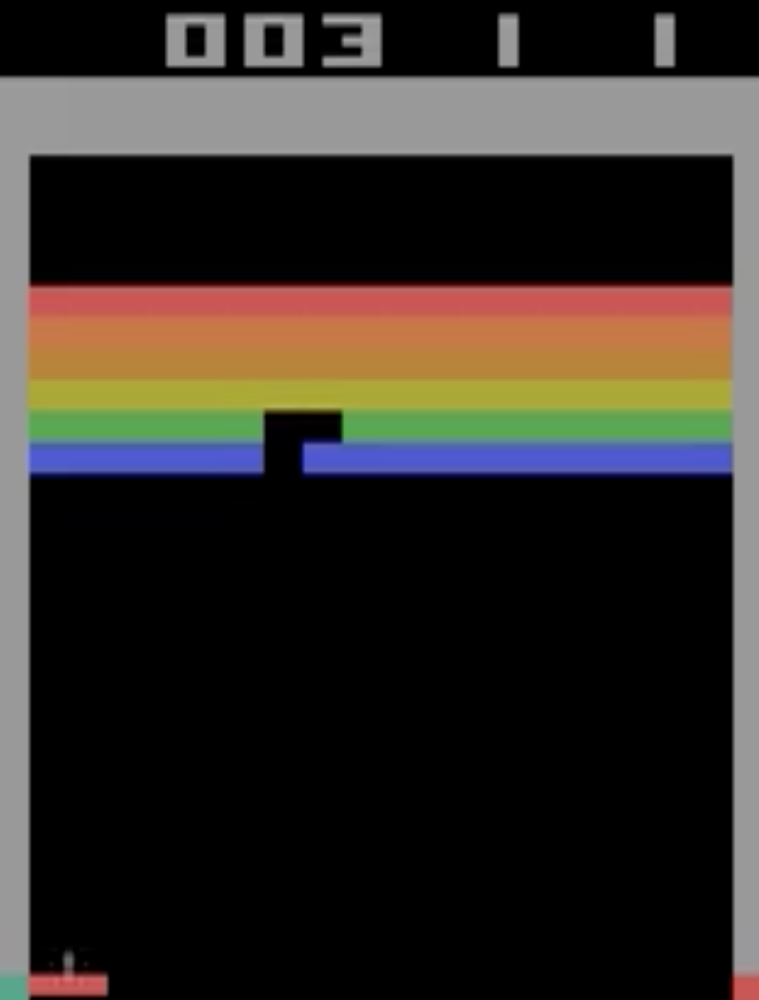

# DQN for Atari Games

This project implements a Deep Q-Network (DQN) agent to play Atari games, based on the groundbreaking 2013 paper "Playing Atari with Deep Reinforcement Learning" by Mnih et al. The implementation focuses on the Breakout game but can be extended to other Atari environments.

## Background

In 2013, DeepMind introduced a novel approach to reinforcement learning that combined Q-learning with deep neural networks. This method, known as Deep Q-Network (DQN), was able to learn to play Atari 2600 games directly from pixel inputs, achieving human-level performance on many games. The key innovations included:

1. Experience Replay: Storing and randomly sampling past experiences to break correlations in the observation sequence.
2. Target Network: Using a separate network for generating targets in the Q-learning update, updated periodically.

## Implementation Details

This implementation includes the following key components:

1. DQN Agent: Implements the core DQN algorithm, including epsilon-greedy action selection and experience replay.
2. Q-Network: A neural network that approximates the Q-function, mapping states to action values.
3. Atari Environment Wrapper: Preprocesses Atari game frames, including resizing, grayscale conversion, and frame stacking.
4. Training Loop: Handles the interaction between the agent and the environment, updating the network and logging progress.
5. Evaluation Script: Allows for evaluation of trained models, including video recording of gameplay.

## Project Structure

```
rl-dqn-atari/
│
├── src/
│   ├── agents/
│   │   └── dqn.py
│   ├── envs/
│   │   └── atari_env.py
│   ├── models/
│   │   └── q_network.py
│   └── main.py
│
├── scripts/
│   └── evaluate_2.py
│
├── tests/
│   ├── test_dqn.py
│   ├── test_atari_env.py
│   ├── test_q_network.py
│   └── test_integration.py
│
├── requirements.txt
└── README.md
```

## Setup

1. Clone the repository:
   ```
   git clone https://github.com/boemer00/rl-dqn-atari.git
   cd rl-dqn-atari
   ```

2. Create a virtual environment and activate it:
   ```
   python -m venv atari
   source atari/bin/activate  # On Windows, use `atari\Scripts\activate`
   ```

3. Install the required packages:
   ```
   pip install -r requirements.txt
   ```

4. Install additional dependencies for video saving:
   ```
   pip install imageio[ffmpeg]
   ```

## Usage

### Training

To train the DQN agent on Breakout, run:

```
python src/main.py
```

This will start the training process and save checkpoints periodically.

### Evaluation

To evaluate a trained model, use the evaluation script:

```
python scripts/evaluate_2.py --model best_atari_dqn.pth --episodes 10 --frame-freq 1
```

This will run the agent for 10 episodes and save a video of the gameplay (if possible) or individual frames.

## Current Results

The current implementation shows improvement in playing Breakout, with the agent achieving scores around 7.0 in recent evaluations. However, there is still room for significant improvement to reach human-level performance.



## Known Issues and Future Improvements

1. Video Saving: There may be issues with saving gameplay videos depending on the system setup. A fallback to saving individual frames has been implemented.

2. Performance: While the agent shows learning progress, it has not yet achieved human-level performance on Breakout.

3. Network Architecture: The current implementation uses a simple fully-connected network. Implementing a convolutional neural network (CNN) could significantly improve performance.

4. Advanced DQN Variants: Implementing Double DQN, Dueling DQN, or Prioritized Experience Replay could lead to more stable and effective learning.

5. Hyperparameter Tuning: Further optimization of learning rates, epsilon decay, and other hyperparameters could enhance performance.

6. Multi-game Support: Extend the implementation to support multiple Atari games beyond Breakout.

Contributions and suggestions for improvements are welcome!
